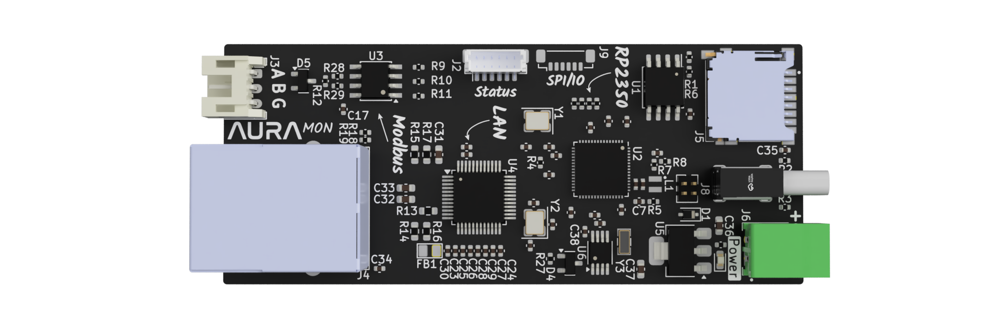

<picture>
  <source media="(prefers-color-scheme: dark)" srcset="http://svg.wiersma.co.za/github/project.v2?title=aura mon&tag=energy%20data%20logger&mode=dark">
  <source media="(prefers-color-scheme: light)" srcset="http://svg.wiersma.co.za/github/project.v2?title=aura mon&tag=energy%20data%20logger">
  
</picture>

`Aura Mon` is an energy datalogger specifically targeting the tiny [SPM01](https://www.bituo-technik.com/product/spm01-flexible-1pn-63a/).

Features:

* RP2350 microcontroller
* Ethernet for reliable network connectivity
* SDCard for storage
* RTC
* Modbus RTU over RS485

## Why

The goal of this project is to create a reliable and easy to use energy datalogger that can be used to monitor energy consumption in a home or small business.
The SPM01 is a very affordable energy meter that can measure voltage, current, power, energy and power factor. This reduces the space needed in small electrical panels,
making it ideal for home use.

## Powering

The board can be powered using an external 5V power supply connected to the screw terminals. For testing purposes, it can also be powered via USB-C, after connecting the onboard jumper.

## Firmware

The firmware is currently in development and will be made available on GitHub once it is stable enough for public use.

## Changelog

#### v0.1.0

* Initial schematic and board
