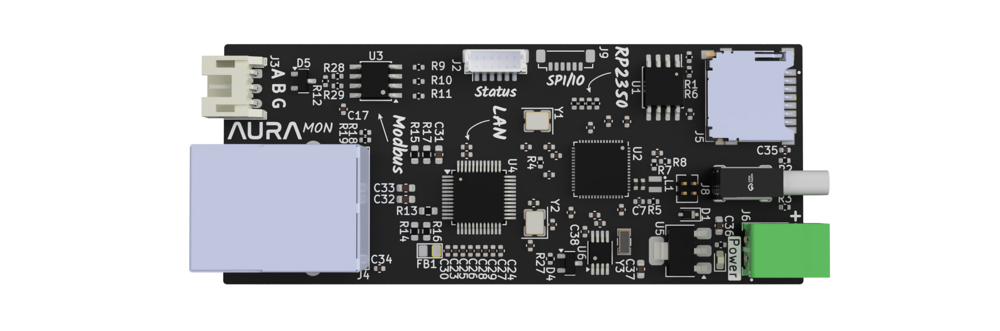
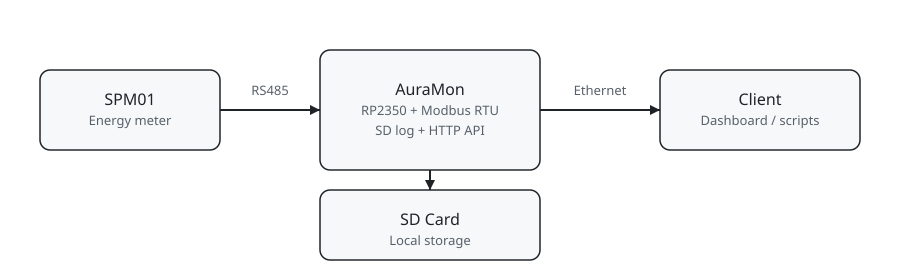
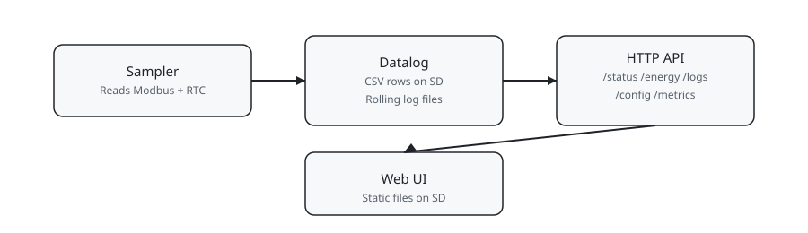

<picture>
  <source media="(prefers-color-scheme: dark)" srcset="http://svg.wiersma.co.za/github/project.v2?title=aura mon&tag=energy%20data%20logger&mode=dark">
  <source media="(prefers-color-scheme: light)" srcset="http://svg.wiersma.co.za/github/project.v2?title=aura mon&tag=energy%20data%20logger">
  
</picture>

`Aura Mon` is an RP2350-based energy data logger built around the tiny [SPM01](https://www.bituo-technik.com/product/spm01-flexible-1pn-63a/) Modbus meter. It samples power data over RS485, stores it on an SD card, and serves a local HTTP API and web UI over Ethernet.

## At a glance

* RP2350 microcontroller
* Modbus RTU over RS485 (SPM01)
* Ethernet for reliable network connectivity
* SD card logging and static web UI hosting
* RTC for timestamped data
* HTTP API with OTA updates and metrics

## System overview

## Data flow

## Why

The goal of this project is to create a reliable and easy-to-use energy data logger that can be used to monitor energy consumption in a home or small business. The SPM01 is a very affordable energy meter that can measure voltage, current, power, energy, and power factor while fitting in tight electrical panels.

## Quick start

1. Assemble the board and connect the SPM01 to the RS485 terminals.
2. Insert an SD card (required for logging).
3. Power the board with a regulated 5V supply on the screw terminals (or via USB-C with the jumper fitted for testing).
4. Connect Ethernet and find the device IP via your router's DHCP lease table.
5. Open `http://<device-ip>` to view the UI and use the API.

## Firmware

The firmware lives in `firmware/` and is written in C++ using the Arduino framework.

* Build/flash instructions: `firmware/FIRMWARE.md`
* HTTP API reference: `firmware/API.md`

### API highlights

* `GET /status` for live readings and runtime stats.
* `GET /energy` for CSV data export.
* `GET /logs` for log streaming.
* `GET`/`POST /config` for device configuration.
* `POST /ota` for firmware updates.
* `GET /metrics` for Prometheus-style metrics.

## Powering

The board can be powered using an external 5V power supply connected to the screw terminals. For testing purposes, it can also be powered via USB-C after connecting the onboard jumper.

## Safety

> [!WARNING]
> This project interfaces with mains-connected equipment. Only install it if you are qualified and follow local electrical safety requirements.

## Project status

The firmware and hardware are still in development and are only tested on the author's hardware. Expect rough edges and please report issues or improvements.

## Changelog

#### v0.1.0

* Initial schematic and board
* Initial firmware with basic functionality to read from the SPM01 and store data on the SD card
