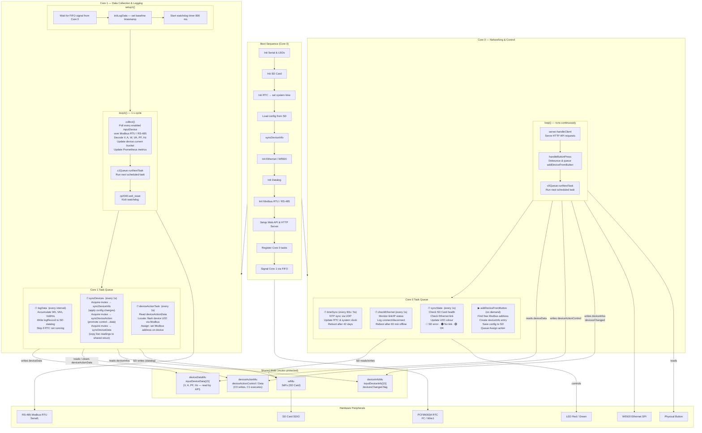

# Firmware Architecture

The firmware runs on an RP2040 dual-core microcontroller. Each core has a dedicated role: **Core 0** handles networking, the web API, and system housekeeping, while **Core 1** handles real-time energy data collection and storage.

## Core Responsibilities

| | Core 0 | Core 1 |
|---|---|---|
| **Main loop focus** | HTTP request handling & button debounce | Energy data collection via Modbus (1 s cycle) |
| **Scheduled tasks** | `timeSync`, `checkEthernet`, `syncState` | `logData`, `syncDevices`, `deviceActionTask` |
| **On-demand tasks** | `addDeviceFromButton` (button press) | — |
| **Watchdog** | — | 800 ms watchdog, kicked each collection cycle |
| **LED control** | `syncState` sets colour, `Ticker` blinks at 1 Hz | — |

## Task Priorities (higher = runs first when multiple tasks are due)

| Task | Core | Priority |
|---|---|---|
| `logData` | 1 | 7 |
| `syncDevices` | 1 | 6 |
| `timeSync` | 0 | 5 |
| `deviceActionTask` | 1 | 5 |
| `checkEthernet` | 0 | 5 |
| `syncState` | 0 | 4 |

