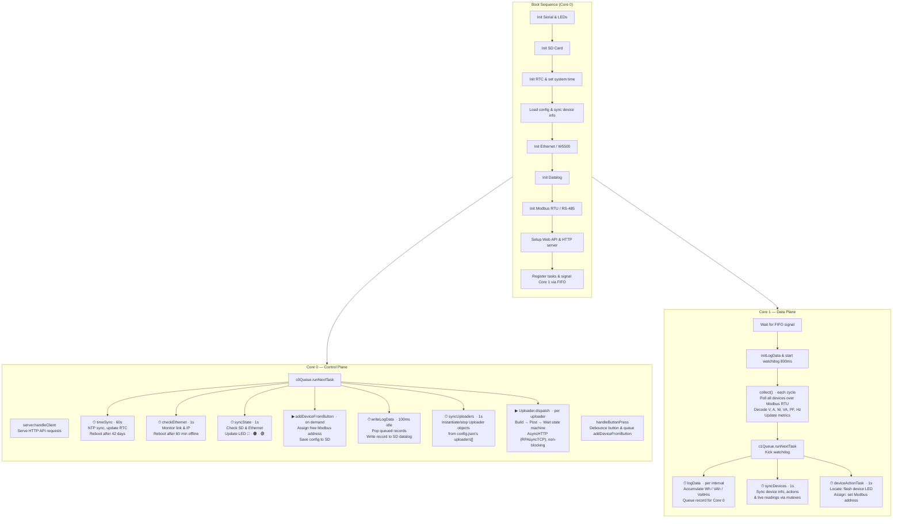

# Firmware Architecture

The firmware runs on an RP2040 dual-core microcontroller. Each core has a dedicated role: **Core 0 (Control Plane)** handles networking, the web API, and system housekeeping, while **Core 1 (Data Plane)** handles real-time energy data collection and storage.

```mermaid
flowchart TD
    subgraph BOOT["Boot Sequence (Core 0)"]
        direction TB
        B1[Init Serial & LEDs] --> B2[Init SD Card]
        B2 --> B3[Init RTC & set system time]
        B3 --> B4[Load config & sync device info]
        B4 --> B5[Init Ethernet / W5500]
        B5 --> B6[Init Datalog]
        B6 --> B7[Init Modbus RTU / RS-485]
        B7 --> B8[Setup Web API & HTTP server]
        B8 --> B9[Register tasks & signal Core 1 via FIFO]
    end

    subgraph C0["Core 0 — Control Plane"]
        direction TB
        L0A[server.handleClient\nServe HTTP API requests]
        L0B[handleButtonPress\nDebounce button & queue addDeviceFromButton]
        L0C[c0Queue.runNextTask]

        T0A["⏱ timeSync  · 60s\nNTP sync, update RTC\nReboot after 42 days"]
        T0B["⏱ checkEthernet  · 1s\nMonitor link & IP\nReboot after 60 min offline"]
        T0C["⏱ syncState  · 1s\nCheck SD & Ethernet\nUpdate LED  🔴 · 🟠 · 🟢"]
        T0D["▶ addDeviceFromButton  · on demand\nAssign free Modbus address\nSave config to SD"]
        T0E["⏱ writeLogData  · 100ms idle\nPop queued records\nWrite record to SD datalog"]
        T0F["⏱ syncUploaders  · 1s\nInstantiate/stop Uploader objects\nfrom config.json's uploaders[]"]
        T0G["▶ Uploader.dispatch  · per uploader\nBuild → Post → Wait state machine\nAsyncHTTP (RPAsyncTCP), non-blocking"]

        L0C --> T0A & T0B & T0C & T0D & T0E & T0F & T0G
    end

    subgraph C1["Core 1 — Data Plane"]
        direction TB
        S1[Wait for FIFO signal] --> S2[initLogData & start watchdog 800ms]

        L1A["collect()  · each cycle\nPoll all devices over Modbus RTU\nDecode V, A, W, VA, PF, Hz\nUpdate metrics"]
        L1B[c1Queue.runNextTask\nKick watchdog]

        T1A["⏱ logData  · per interval\nAccumulate Wh / VAh / VoltHrs\nQueue record for Core 0"]
        T1B["⏱ syncDevices  · 1s\nSync device info, actions\n& live readings via mutexes"]
        T1C["⏱ deviceActionTask  · 1s\nLocate: flash device LED\nAssign: set Modbus address"]

        S2 --> L1A --> L1B
        L1B --> T1A & T1B & T1C
    end

    BOOT --> C0 & C1
```

## Core Responsibilities

| | Core 0 | Core 1 |
|---|---|---|
| **Main loop focus** | HTTP request handling & button debounce | Energy data collection via Modbus (1 s cycle) |
| **Scheduled tasks** | `timeSync`, `checkEthernet`, `syncState`, `writeLogData`, `syncUploaders`, one `Uploader::dispatch` per configured uploader | `logData`, `syncDevices`, `deviceActionTask` |
| **On-demand tasks** | `addDeviceFromButton` (button press) | — |
| **Watchdog** | — | 800 ms watchdog, kicked each collection cycle |
| **LED control** | `syncState` sets colour, `Ticker` blinks at 1 Hz | — |

## Task Priorities (higher = runs first when multiple tasks are due)

| Task | Core | Priority |
|---|---|---|
| `logData` | 1 | 7 |
| `syncDevices` | 1 | 6 |
| `writeLogData` | 0 | 6 |
| `timeSync` | 0 | 5 |
| `deviceActionTask` | 1 | 5 |
| `checkEthernet` | 0 | 5 |
| `syncState` | 0 | 4 |
| `syncUploaders` | 0 | 3 |
| `Uploader::dispatch` (each uploader) | 0 | 2 |

## Data Log Record Queue

`logData` on Core 1 accumulates energy readings, but does not touch the SD card. Once an
interval completes, the record is copied onto a fixed size FIFO queue (`logQueue`, 8 records)
and `writeLogData` on Core 0 pops it and writes it to the data log. This keeps SD card IO,
which can block for tens of milliseconds, off the collection core.

- If the queue is full, `logData` retries on the next cycle rather than dropping the record,
  so the log slips but no data is lost.
- Records are queued and written in timestamp order, which the data log requires.
- A record that fails to write is retried up to 5 times, then dropped so it cannot block the
  records behind it.
- On a controlled reboot, the queue is drained before the data log is closed.

## Uploaders (InfluxDB2/3, Home Assistant, ...)

`Uploader` (`src/uploader/uploader.h/.cpp`) is the base class for Core0 tasks that push data
log records to a remote service. `UploaderConfig` (`src/config.h`) is its persisted,
user-editable counterpart: an entry in config.json's `uploaders` array (`id`, `type`,
`enabled`, `interval`, and a free-form `settings` object whose schema is owned by the
concrete uploader type). `uploader_registry.cpp` is the only code that creates or stops
`Uploader` instances, reconciling `uploaderConfigs[]` with live instances whenever the config
changes (`syncUploaders`, mirroring `syncDevices`'s `devicesChanged` pattern) — concrete
uploader types are registered there as they are implemented.

- `InfluxDB2Uploader` (`src/uploader/influxdb2_uploader.h/.cpp`, `type: "influxdb2"`) writes
  one line-protocol point per enabled, named device per interval (plus one for mains
  frequency) to an InfluxDB 2.x bucket via `/api/v2/write`. Settings: `url`, `org`, `bucket`,
  `token`, optional `measurement` (default `"aura-mon"`). Its settings parsing and
  line-protocol formatting are pulled out into `src/uploader/influxdb2_format.h/.cpp`, which
  has no HTTP/xbuf/data-log dependencies and is covered by native unit tests
  (`test/test_influxdb2`); the surrounding HTTP/data-log glue in `influxdb2_uploader.cpp`
  follows `Uploader` itself in being hardware-only and not natively tested.

Each `Uploader` runs as its own lowest-priority Core0 task, built on `lib/AsyncHTTP`
(`asyncHTTPrequest` ported onto `RPAsyncTCP`) so a request in flight never blocks anything
else: `dispatch()` is a non-blocking `Build → Post → Wait` state machine that returns almost
immediately every tick.

- **No data is lost on a network outage.** The data log already retains up to ~180 days of
  history on SD; an uploader only tracks how far it has gotten (`_lastSentTS`), persisted to
  `aura-mon/uploaders/<id>.state`. While the link is down (`eth.isLinked()`/`connected()`
  checked every `Build`), the uploader simply waits and retries — it never advances past data
  it hasn't confirmed as sent, and a reboot resumes from the saved position rather than
  replaying the whole log or skipping ahead.
- **Never blocks SD or networking.** Scheduled at the lowest Core0 priority (below
  `writeLogData`, `checkEthernet`, and `syncState`), so it only runs when nothing more
  important is due, and each state transition does O(1) non-blocking work.
- **Stopping is self-serviced.** The task queue has no cancel primitive, so a disabled or
  misconfigured uploader is told to stop (`requestStop()`); the registry drops its own
  pointer immediately, and the instance deregisters and frees itself (`delete this; return
  0;`) the next time its already-scheduled task runs.

## Hardware Peripherals

| Peripheral | Interface | Used By |
|---|---|---|
| W5500 Ethernet | SPI | Control Plane — HTTP server, NTP, link monitoring |
| RS-485 / Modbus RTU | Serial1 | Data Plane — device polling & address assignment |
| SD Card | SDIO (`sdMu`) | Control Plane — config r/w & datalog writes |
| PCF85063A RTC | I²C / Wire1 | Boot — set system clock |
| LED (Red / Green) | GPIO 10 / 11 | Control Plane — `syncState` sets colour, `Ticker` blinks at 1 Hz |
| Physical Button | GPIO 3 | Control Plane — triggers `addDeviceFromButton` on press |

